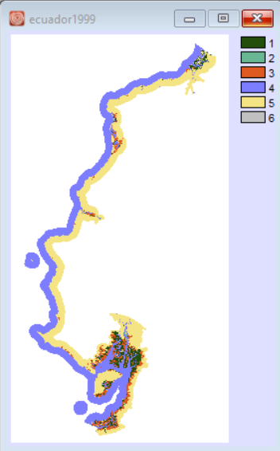
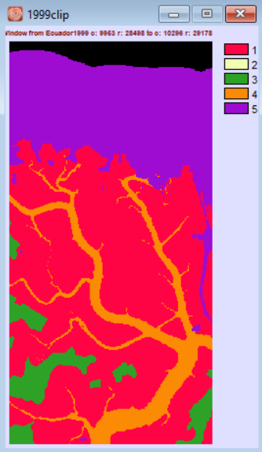

# Quantifying Temporal Land Cover Change Using *rioxarray*
### Claire Wang | 11/27/2020
#### My repository of final project of IDCE 30274 - Programming GIS. This project is about temporal analysis on land-cover change.

## Data Source
- Land cover data from [Clark Labs](https://clarklabs.org/aquaculture/). This site owns a public inventory of pond aquaculture and coastal habitats in Bangladesh, Cambodia, Ecuador, India, Indonesia, Malaysia, Myanmar, Thailand, and Vietnam. Landcover maps are in development for the years 1999, 2014, and 2018 for these countries. 
- [rioxarray](https://corteva.github.io/rioxarray/stable/) and [Rasterio](https://rasterio.readthedocs.io/en/latest/): Python libraries to calculate and plot raster dataset. Some [Turorials](https://carpentries-incubator.github.io/geospatial-python/aio/index.html) can be found here, along with tutorials of [Geopandas](https://geopandas.org/), the library for vector data.

## Motivations and Objectives
- The idea of time series is taken from a spatial statistics course: **Geog 379**. The Professor, Dr. Gil Pontius, spent some time discussing land change over time, and how the change could be quantified and visualized. I became very interested in analyzing land covers' temporal change, and developed a way to quantify change: **anything is classified as change except persistence**. For example, if a pixel in category A 1. changes to category B; 2. changes to category C; 3. persists; 4. changes back to category B - across 4 time periods, this pixel will result in a value of 1+1+0+1 = 3. 
- It doesn't matter which category the pixel changes to, or if it changes back (toggle). As long as it experiences changes, it gains 1.
- This "metric" has insights in quantifying **sensitiveness/volatility** of the land cover, and can be further applied to remote sensing, conservation, and etc..

## My Process
- I use the land cover data of Ecuador. The landcover maps for 2014 and 2018 are based on Landsat 8 imageryand the 1999 data are based on Landsat 5 imagery. The metadata and candcover categories can be found as .txt files under this repository.
- A preview of all categories in 1999: 
 
- Due to processing time, memory, and visualization issues (details can be found in *step_by_step.ipynb* notebook as comments), I focus on a smaller local scale and it look like this:
 
- There are two notebooks in this repository: *step_by_step* and *Function_def*. The former shows all relevant steps, issues coming with source data or Python itself, and my solutions. The latter puts together the analyses into functions. *All processes, comments, and outputs can be seen in the notebooks.*
- This project allows one to **clip** to a wanted scale and/or **specify and map one category**.

## Applications and Limitations
- As seen in *step_by_step.ipynb*, numpy lacks intelligence in understanding raster calculator, that people have to go through extra steps to re-class results.
- I only use land cover change over 3 time points. And I can only run it for local scale on my computer because running for the entire image requires hundreds of GB. To fully analyze large-scaled raster images, consider emptying your disk or using **[TerrSet](https://clarklabs.org/buy/)**! It is a wonderful Geo-spatial Monitoring and Modeling tool **Clark University** developed! It would be more interesting to see more frequent change, in a bigger scale, over a longer time span.
- The function is not yet a full automation. Maybe I need to develop functions with arbitrary arguments and iterations in a *class*.

### Contact me
My email address is wqtclaire@gmail.com. I appreciate any suggestions and comments!
